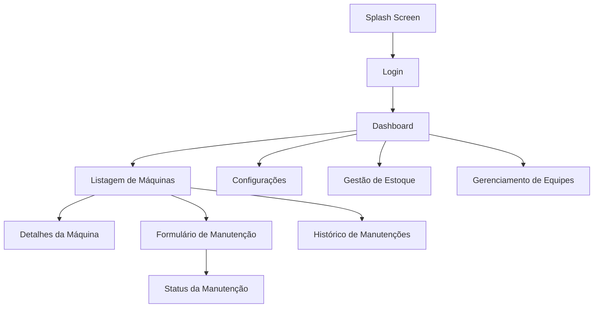

# Documentação do Aplicativo Mobile de Gerenciamento de Máquinas

## Descrição

Este aplicativo foi desenvolvido para facilitar o gerenciamento de máquinas, oferecendo uma interface amigável e intuitiva. Os usuários podem navegar facilmente entre diferentes seções, permitindo um acompanhamento eficiente das máquinas e suas manutenções.

## Funcionalidades

### Listagem de Máquinas
A tela inicial apresenta uma lista clara e concisa das máquinas registradas, exibindo informações essenciais como nome, tipo e localização. Os dados são representados de forma organizada, permitindo uma rápida identificação.

### Detalhes da Máquina
Ao selecionar uma máquina, os usuários são direcionados para uma tela que mostra informações detalhadas, incluindo modelo, data de fabricação e número de série. Essa funcionalidade proporciona uma visão completa de cada máquina.

### Histórico de Manutenções
Os usuários podem acessar um histórico de manutenções recentes, onde são apresentados dados sobre as datas e o status de cada manutenção realizada. Essa seção ajuda a acompanhar o histórico de manutenção de cada máquina.

### Marcação de Máquina em Manutenção
O aplicativo permite que os usuários marquem uma máquina como "em manutenção". Essa funcionalidade inclui a opção de adicionar comentários, facilitando a comunicação sobre o estado atual da máquina.

### Solicitações de Manutenção
Os usuários podem criar solicitações de manutenção através de um formulário que inclui campos para descrever o problema, definir a prioridade e designar um responsável. Isso ajuda a organizar e priorizar as necessidades de manutenção.

### Exibição do Status da Manutenção
Uma tela dedicada exibe o status das solicitações de manutenção, mostrando informações fictícias sobre se a manutenção está pendente, em andamento ou concluída. Essa funcionalidade ajuda a manter todos informados sobre o andamento das manutenções.

### Registro de Peças e Materiais
O aplicativo simula um registro de peças e materiais utilizados nas manutenções. Os usuários podem visualizar informações sobre os itens usados, o que facilita o controle de estoque.

### Consulta de Estoque de Peças
Uma interface dedicada exibe uma lista de peças disponíveis no estoque, permitindo que os usuários realizem consultas sobre a disponibilidade de itens necessários para manutenções.

### Navegação e Fluxo Lógico
O aplicativo foi projetado para garantir que a navegação entre as diferentes telas seja fluida e lógica, proporcionando uma experiência de usuário agradável, mesmo sem integração com dados reais.

## Estrutura de Navegação

O aplicativo é organizado em uma estrutura de navegação que inclui as seguintes telas:

- **Splash Screen**: Tela inicial que apresenta o aplicativo.
- **Login**: Tela para autenticação do usuário.
- **Registro**: Permite que novos usuários se registrem.
- **Recuperação de Senha**: Para usuários que esqueceram suas senhas.
- **Dashboard**: Tela principal com acesso a diferentes funcionalidades.
- **Configurações**: Opções para personalizar a experiência do usuário.
- **Listagem de Máquinas**: Exibe todas as máquinas registradas.
- **Formulário de Manutenção**: Permite a criação de solicitações de manutenção.
- **Histórico de Manutenções**: Lista manutenções realizadas.
- **Gestão de Estoque**: Consulta de peças disponíveis.
- **Gerenciamento de Equipes**: Tela para gerenciar as equipes de manutenção.

## Estrutura de Telas



## Instalação
Para instalar o aplicativo, siga os passos abaixo:

### Clone o repositório:

```bash
git clone https://github.com/seu_usuario/nome_do_repositorio.git
```
Abra o projeto no Visual Studio Code: Navegue até a pasta do projeto chamada **sigemApp**.

Instale as dependências: No terminal do VS Code, execute:

```bash
npm install
```

Inicie o aplicativo: Para rodar o aplicativo, execute:

```bash
npx expo start
```
Abra com o aplicativo Expo: Utilize o aplicativo Expo em seu dispositivo móvel para escanear o QR code exibido no terminal ou na página do navegador que se abrirá.

## Conclusão
Este aplicativo visa simplificar o gerenciamento de máquinas e suas manutenções, com uma interface fácil de usar e funcionalidades que atendem às necessidades dos usuários. Sinta-se à vontade para explorar e simular a experiência de gerenciamento de máquinas!

